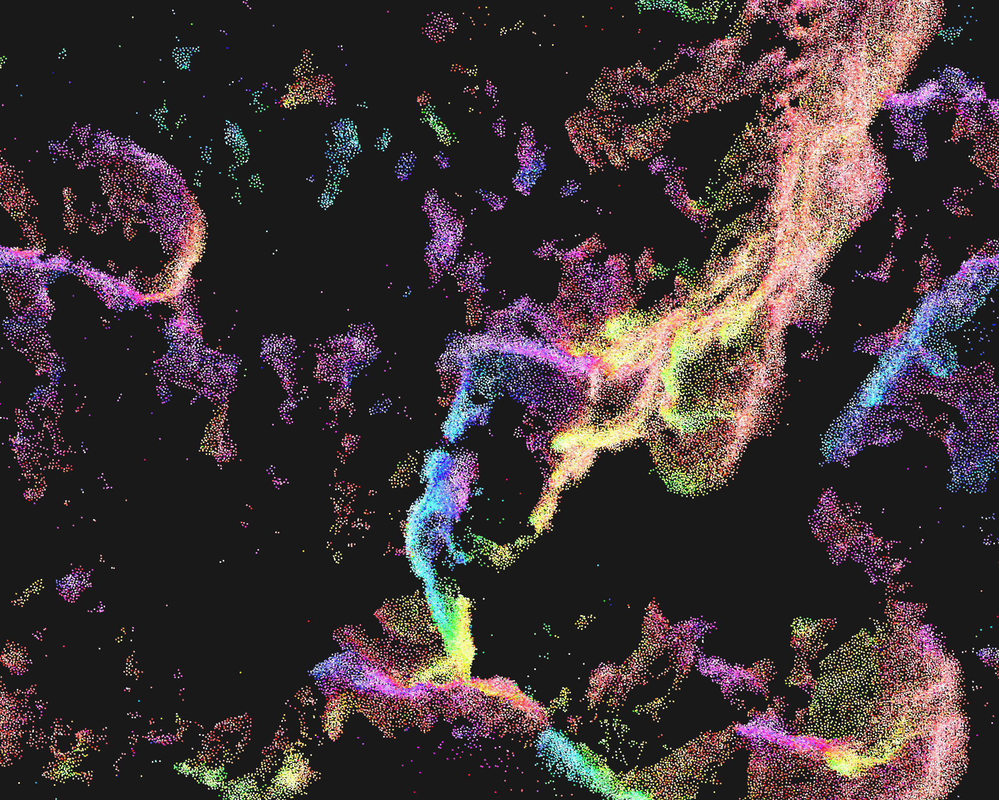

# Approxiflock

This is a 2D boid simulator that uses approximation to allow real time rendering of fairly large flocks. 🕊

`cargo run --release -- -c example-config.toml`

Aims:

- Fast, CPU based simulation.
- Support as many boids as possible.
- Render at 60fps.

This is achieved by using:

- Approximate "neighbour grid" data structure.
- Lookup table based FOV culling
- Direct use of OpenGL for rendering.

## Configuring

The simulation parameters can be set via a toml configuration file.

See `example-config.toml` for an explination of the different parameters.
